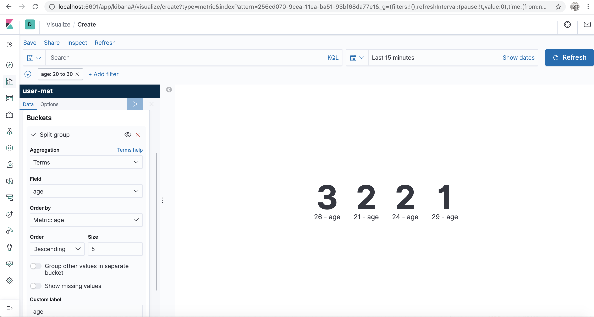

# spring-boot-with-docker
A users microservice to register and retrieve user. All the users created using this service will get stored in elasticsearch. This repo will demonstrate how to build docker image of Spring Boot microservice and connect it with other containers. Plus, I have created an elasticsearch repository using elasticsearch's high level REST client to POST and GET a user. All the services will run in separate docker containers but in same network say elk.

### Prerequisites:
1. Docker, recommended: 2.2+
2. Running Docker containers for elasticsearch and kibana. 
    refer - [docker-setup-elastic-kibana](https://github.com/nishant121212/HW-tutorial-docker-setup-elastic-kibana)

OR run below commands
###### Network
    docker network create elk
###### ELastic
    docker run -d 
        --name elasticsearch 
        --net elk 
        -p 9200:9200 
        -p 9300:9300 
        -e "discovery.type=single-node" 
        elasticsearch:7.6.2
###### Kibana
    docker run -d 
        --link elasticsearch:elasticsearch 
        --name kibana 
        --net elk 
        -p 5601:5601 
        kibana:7.6.2

### Build instructions
    mvn clean install

### Run instructions
    1. cd /path/to/project's/base/directory i.e. spring-boot-with-docker
    2. docker build -t users-docker-service .
    3. docker run -d 
	        --link elasticsearch:elasticsearch 
	        --name users-docker-service 
	        --net elk  
	        -p 9212:9212 
	        users-docker-service    
    
### Kibana age count metric

